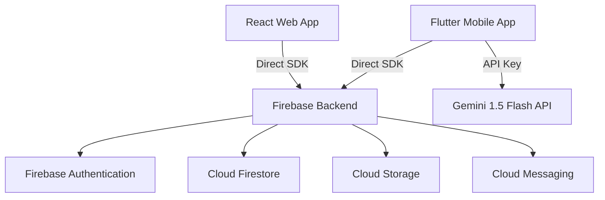

# SmartBloodLife - Client Handover Document

This document outlines the architecture, database schema, deployment process, and maintenance guide for the **SmartBloodLife** platform.

---

## 1. System Architecture

SmartBloodLife is built using a modern decoupled architecture where both the React web application and the Flutter mobile application interface directly with a consolidated Firebase backend.



### Technology Stack
*   **Web Frontend**: React (v18.2), Vite (v5.1), TailwindCSS (v3.4)
*   **Mobile Client**: Flutter (v3.19+), Riverpod (v2.5+), GoRouter (v14+)
*   **Backend & Security**: Firebase Auth, Cloud Firestore, Firebase Storage, and Firestore Security Rules (v2)
*   **AI Integration**: Google Generative AI (Gemini 1.5 Flash)

---

## 2. Directory Mapping

```
SmartBloodLife/
│
├── web/                      # React Web App (Vite project)
│   ├── src/
│   │   ├── admin/            # Admin pages and analytics
│   │   ├── components/       # Reusable React components (UI/Layout)
│   │   ├── context/          # Auth and Theme context providers
│   │   ├── lib/              # Firebase SDK initialization
│   │   ├── pages/            # Public web pages (Home, Search, Register)
│   │   ├── services/         # Firestore read/write logic
│   │   └── utils/            # Verification & eligibility helpers
│   └── vite.config.js        # Vite config with manual chunk splitting
│
├── mobile/                   # Flutter Mobile App
│   ├── lib/
│   │   ├── main.dart         # Entry point & Hive initialization
│   │   └── src/
│   │       ├── core/         # Routing, themes, constants, secure storage
│   │       ├── data/         # Models & repositories (Firestore & Gemini)
│   │       └── presentation/ # Riverpod providers and UI screens
│   ├── test/                 # Automated unit tests
│   └── pubspec.yaml          # Flutter package definitions
│
├── firebase/                 # Firebase Backend Assets
│   └── firestore.rules       # Security rules protecting client data
│
└── firestore.indexes.json    # Composite database query indexes
```

---

## 3. Environment Variables & Setup

### A. Web App Environment Setup (`web/.env`)
Create a `.env` file in the `web/` directory with the following variables:
```env
VITE_FIREBASE_API_KEY="your-api-key"
VITE_FIREBASE_AUTH_DOMAIN="your-auth-domain.firebaseapp.com"
VITE_FIREBASE_PROJECT_ID="your-project-id"
VITE_FIREBASE_STORAGE_BUCKET="your-project-id.appspot.com"
VITE_FIREBASE_MESSAGING_SENDER_ID="your-sender-id"
VITE_FIREBASE_APP_ID="your-app-id"
VITE_FIREBASE_MEASUREMENT_ID="your-measurement-id"
```

### B. Flutter App Configuration Setup
1. **Android Configuration**: Place the `google-services.json` file in `mobile/android/app/`.
2. **iOS Configuration**: Place the `GoogleService-Info.plist` file in `mobile/ios/Runner/`.
3. **Gemini AI API Key**: Injected during compilation using `--dart-define`:
   ```bash
   flutter run --dart-define=GEMINI_API_KEY=your_gemini_api_key
   ```

---

## 4. Production Deployment

### A. Prerequisite Tools
Install the Firebase CLI globally:
```bash
npm install -g firebase-tools
firebase login
```

### B. Deploying Backend Rules & Indexes
Deploy rules and indexes directly from the root workspace:
```bash
firebase use your-project-id
firebase deploy --only firestore
```

### C. Compiling & Deploying the Web Application
Run the build script to generate optimized, code-split assets:
```bash
cd web
npm install
npm run build
firebase deploy --only hosting
```

---

## 5. First-Time Administrative Account Setup

Firestore security rules enforce strict role-based access control (RBAC). Follow these steps to provision your first Administrative user:

1. Register an account using the normal Email/Password sign-up on the website or mobile app.
2. Open the **Firebase Console**, navigate to **Firestore Database**, and go to the `users` collection.
3. Find the document matching your user's `uid` (UID is visible in the Auth tab).
4. Edit the `role` field value from `"donor"` to `"admin"` or `"super_admin"`.
5. You can now log in via `/admin/login` and access the secure Admin Dashboard.

---

## 6. Firestore Database Schema

### Collection: `users`
*   `id`: String (UID)
*   `name`: String
*   `email`: String
*   `phone`: String
*   `role`: String (`donor` | `admin` | `super_admin`)
*   `bloodGroup`: String
*   `createdAt`: Timestamp

### Collection: `donors`
*   `id`: String (Document ID)
*   `userId`: String (UID reference)
*   `name`: String
*   `bloodGroup`: String
*   `age`: Number
*   `gender`: String
*   `weight`: Number
*   `city`: String
*   `location`: GeoPoint (latitude, longitude)
*   `lastDonationDate`: Timestamp (nullable)
*   `isAvailable`: Boolean
*   `active`: Boolean
*   `donationCount`: Number
*   `photoUrl`: String
*   `phone`: String
*   `whatsapp`: String
*   `verified`: Boolean
*   `registeredAt`: Timestamp

### Collection: `emergencies`
*   `id`: String
*   `bloodGroup`: String
*   `unitsNeeded`: Number
*   `hospital`: String
*   `city`: String
*   `contactName`: String
*   `contactPhone`: String
*   `urgency`: String (`critical` | `urgent` | `standard`)
*   `notes`: String
*   `patientName`: String
*   `status`: String (`active` | `fulfilled` | `cancelled`)
*   `active`: Boolean
*   `createdBy`: String (UID reference)
*   `createdAt`: Timestamp
*   `expiresAt`: Timestamp

---

## 7. Database Security & Optimization

### Security Audits
*   **Field Locking**: Firestore rules verify changes to documents in the `donors` collection. Non-administrative users (including verified donors) are barred from editing administrative parameters:
    ```javascript
    request.resource.data.diff(resource.data).affectedKeys().hasAny(['verified', 'userId', 'donationCount', 'registeredAt'])
    ```
*   **Query Indexing**: The `firestore.indexes.json` contains index definitions preventing runtime failures for complex queries on the web and mobile apps.

### Backup Strategy
To backup the Firestore database to Cloud Storage:
1. Enable backups in the Google Cloud Console.
2. Run backup export command via `gcloud`:
   ```bash
   gcloud firestore export gs://your-backup-bucket-name
   ```
